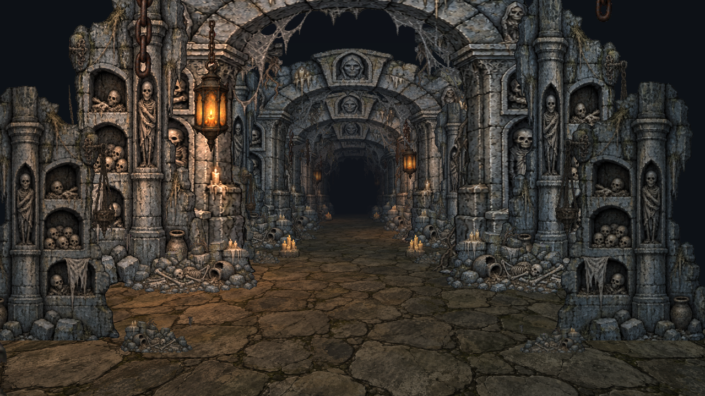
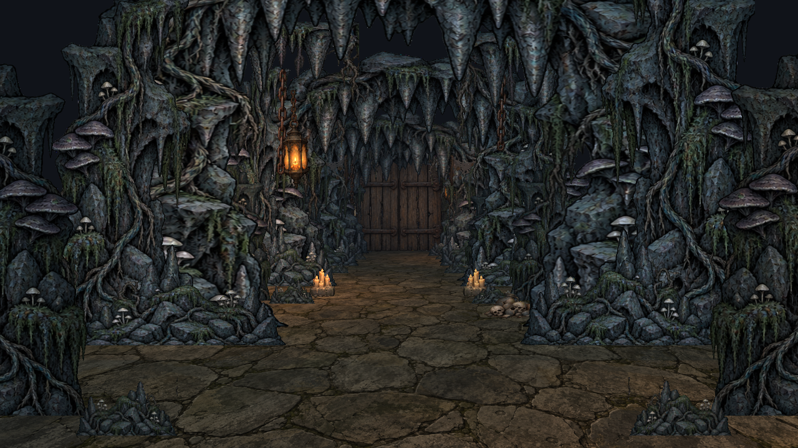
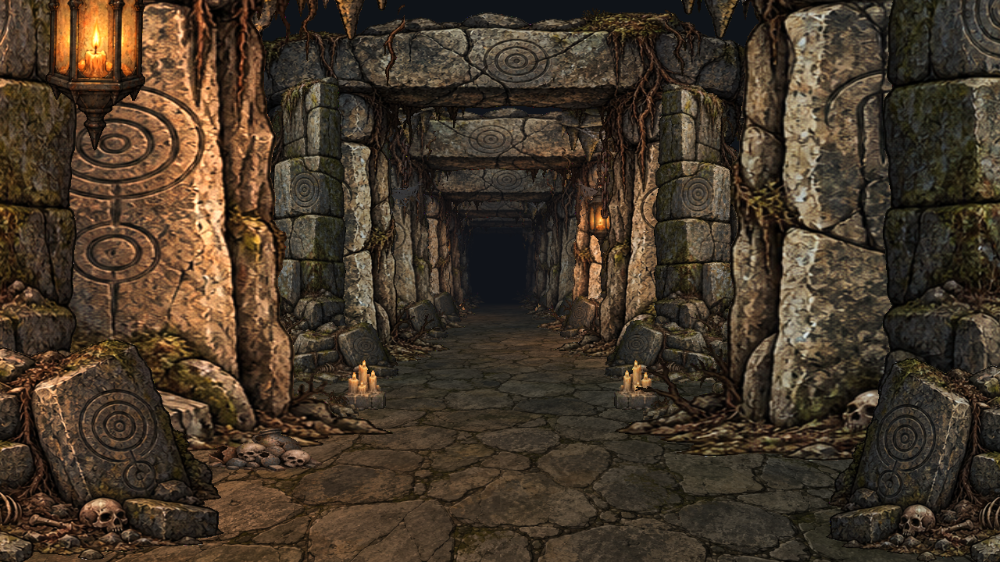

# Сцена 1 — Подземелье

Сцена `Assets/Scenes/Scene1_Dungeon.unity` развивает первую демонстрацию с квадратными спрайтами в детализированное рисованное подземелье. Старый `FlatDungeon.unity` сохранён как прототип, а сельская дорога остаётся в `CountryRoad256.unity`.

## Три локации

1. **Катакомбы:** каменные арки, погребальные ниши, черепа, свечи и паутина.
2. **Мрачные пещеры:** скалы, корни, сталактиты и небольшие грибы.
3. **Мегалитический подвал:** массивные резные монолиты, древние перемычки, обломки плит и подвесные цепи.

Комнаты последовательно соединены деревянными дверями. Между досками есть настоящие прозрачные щели. При приближении створки плавно открываются внутрь прохода; перезапуск закрывает их.

## Запуск и управление

Откройте сцену и нажмите Play. W / ↑ — идти, пробел — автопрогулка или пауза, R — начать сначала. Камера движется только вперёд и не поворачивается мышью. Врагов нет.

Подземелье использует обычный детализированный рендер 16:9. Низкое разрешение 256 × 256 относится только к отдельной сельской сцене.

## Слои окружения

Крупные вырезанные арки стоят на последовательных глубинах Z. Между ними расположены боковые каменные панели, низкие обломки, потолочные корни, цепи, фонари, свечи и паутина. Пол покрыт отдельной рисованной текстурой каменных плит. У каждого спрайта декораций есть прозрачный фон, поэтому слои перекрывают друг друга по контуру рисунка.

Это реальные плоскости в 3D-пространстве: перспектива и движение камеры создают параллакс. Двери вращаются вокруг вертикальных петель; цепи и фонари слегка качаются вокруг верхней точки подвеса.

Цвет и тени нарисованы в самих ассетах. `DungeonCard` добавляет тёплые мерцающие пятна света вокруг фонарей и атмосферный туман. Это художественная имитация освещения плоского рисунка, без объёмных теней от каждого спрайта.

## Редактирование

- `Assets/Dungeon/Art`: оригинальные атласы и сохранённые промпты генерации ImageGen.
- `Assets/Dungeon/Sprites`: вырезанные области атласов.
- `BuildDungeonScene`: генератор расположения декораций и сборки трёх комнат.
- `DungeonWalker`: камера, управление, подписи локаций.
- `DungeonDoor`: раскрытие створок.
- `DungeonSway`: движение подвесных элементов и мерцание источников света.
- `DungeonCard` и `DungeonGround`: отрисовка декораций и каменного пола.

Генератор использует явные прямоугольники вырезания: рисунки атласов расположены не по равномерной сетке. При замене атласа проверьте границы каждого спрайта.

Перед ручной переработкой сделайте копию сцены и изменяемых генерируемых ассетов: повторная сборка заменяет созданные генератором данные.

## Проверка в Unity

В сцене 358 спрайтов, 24 слоя арок, две переходные двери и 36 качающихся подвесных элементов. Проверен непрерывный автоход на обычной скорости 3 м/с: после первой двери камера вошла в пещеры, после второй — в мегалитический подвал. Обе двери успевали полностью открыться до прохода камеры. На отметке 108 м автоход остановился; перезапуск вернул камеру к началу и закрыл двери. На момент проверки ошибок и предупреждений Unity не было.

## Работа с референсом

Исходное видео — монтаж трейлера Shroom and Gloom, а не запись непрерывного прохождения. В нём видны вложенные рисованные проходы, заполненные верхние и боковые края, отдельные слои у пола и деревянная дверь. В этой сцене воспроизведён принцип композиции и движения через такие слои, а три заданные темы соединены в новый непрерывный маршрут. Арт создан заново в более мрачной средневековой палитре; покадровой копией всего трейлера сцена не является.
