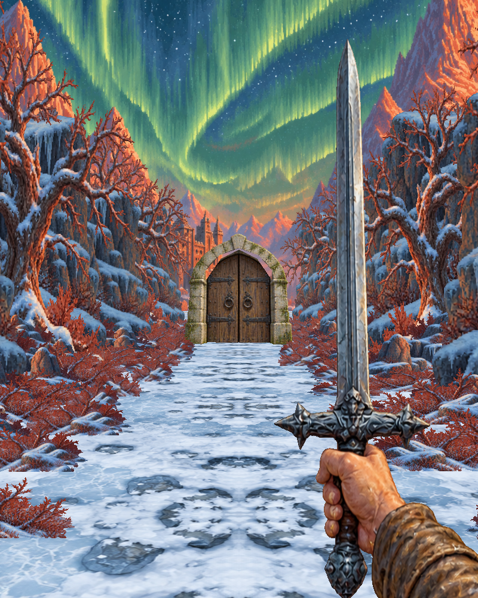
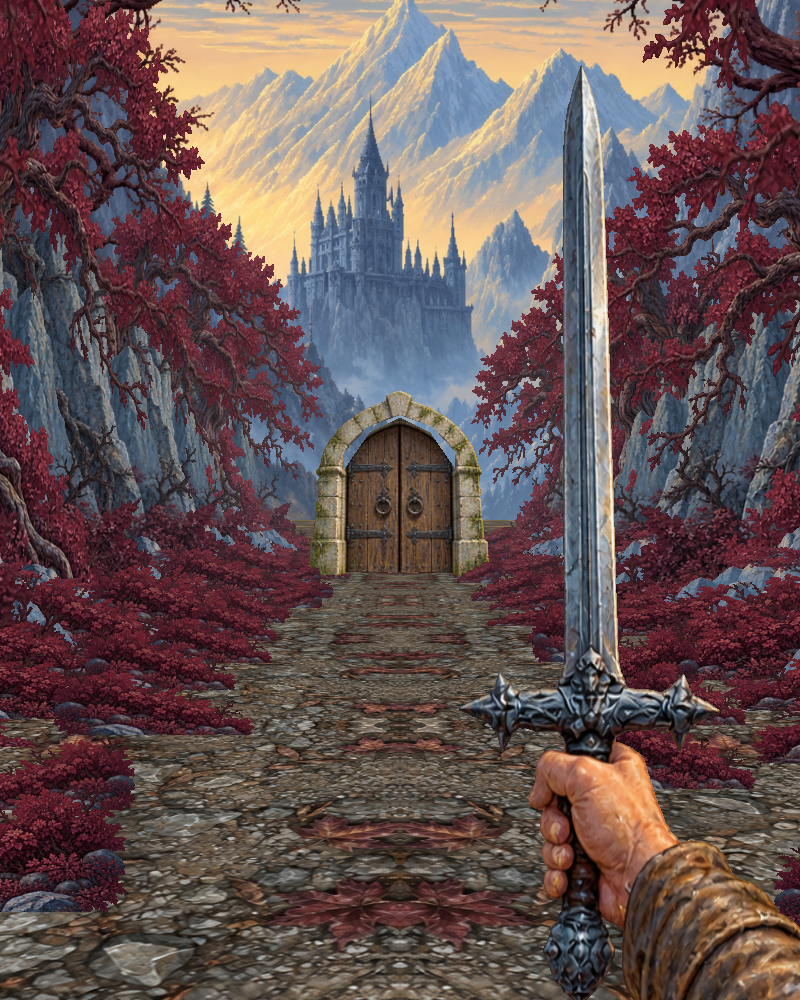
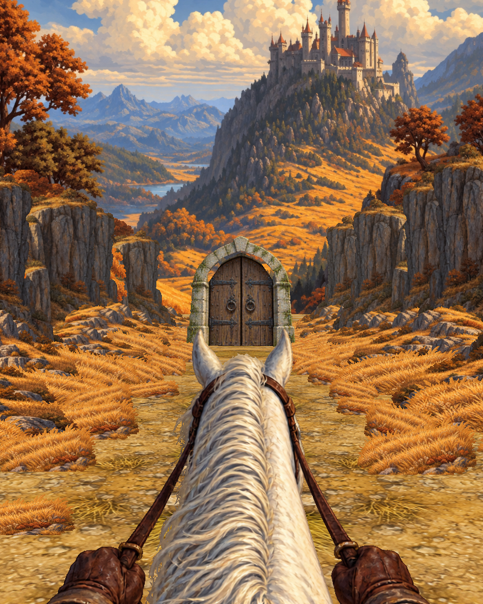
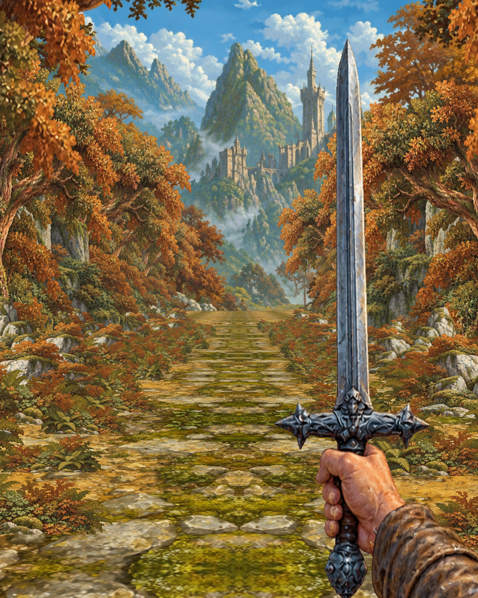

# Сцена 2 — Четыре мира

Новая самостоятельная сцена `Assets/Scenes/Scene2_FourRealms.unity` по первым четырём пейзажам видеореференса. Сцена 1 «Подземелье», просёлочная дорога и квадратный прототип сохранены отдельно.

## Маршрут

| Время непрерывного движения | Локация | Визуальный мотив |
| --- | --- | --- |
| 0–10 с | Северное сияние | Снег, оранжевые скалы, зелёное сияние, древняя крепость |
| 10–20 с | Замок в ущелье | Холодные голубые горы, бледное золотое небо, бордовые деревья |
| 20–30 с | Золотая долина | Открытый осенний пейзаж, замок над скалами, белая лошадь на переднем плане |
| 30–40 с | Лесная крепость | Охристая тропа, зелёные горы, плотная листва и высокий замок |

Каждая локация имеет длину 20 м, скорость равна 2 м/с. Время считается при движении: остановка на W или выключенный автоход не расходуют путь. Три рисованные двустворчатые двери стоят на отметках 20, 40 и 60 м. Они открываются при приближении; пересечение порога переключает окружение с коротким затемнением, не добавляя задержку к сорока секундам. После 80 м движение останавливается.

## Запуск и управление

Открыть сцену и нажать Play либо выбрать **Flat Depth → Scene 2 Four Realms → Open**. В Windows доступен `Открыть четыре мира.cmd` (требуется Unity CLI в PATH).

- **W / ↑** — двигаться вперёд, пока клавиша удерживается.
- **Пробел** — включить или выключить автоход.
- **R** — начать сначала.

Камера движется строго по оси Z, на высоте 1,7 м, без вращения мышью и бокового движения. Лёгкое покачивание относится только к изображению меча или лошади. Лошадь — элемент вида от первого лица, отдельной механики верховой езды нет. Врагов и боя нет.

## Как устроен визуальный объём

Окружение использует более 600 плоских спрайтов: близкая низкая растительность, камни и кустарники среднего плана, высокие скалы и деревья. На каждом участке они стоят в 22 рядах с шагом около 1,55 м и небольшим смещением. Расположение по X, Y, Z, перекрытия и перспективная камера создают параллакс. Спрайты неподвижны и не требуют billboard, поскольку взгляд не поворачивается.

Замок и дальние горы — большая рисованная плоскость на дальнем плане. Земля — простая геометрия с текстурой. Двери — плоские текстурированные полигоны: арка имеет настоящий вырез, а створки вращаются на отдельных шарнирах. Alpha cutout и запись глубины обеспечивают перекрытия без сортировки полупрозрачных прямоугольников.

Кадр имеет пропорции **4:5** с чёрными полями на широком экране. Это детализированная живописная сцена, без ограничения вывода 256 × 256; пиксельная дорога остаётся отдельной реализацией. Палитры, композиции и мотивы приближены к видео, но новые ассеты не являются точными копиями исходной графики.

## Редактирование

- `Assets/FourRealms/Art/` — десять исходных изображений и промпты ImageGen.
- `Assets/FourRealms/Sprites/` — области атласов с прозрачностью.
- `Assets/FourRealms/Meshes/` — плоские части двери.
- `Assets/Editor/BuildFourRealms.cs` — плотность, масштаб, размещение слоёв и сборка сцены.
- `FourRealmsWalker` — движение, смена локаций, предметы перед камерой и интерфейс.
- `FourRealmsDoor` — открывание створок.
- `PortraitJourneyViewport` — пропорции кадра.
- `FourRealmsCard` / `FourRealmsGround` — шейдеры рисунков и земли.

**Rebuild** заново создаёт сцену и перезаписывает ручные изменения в ней. Для своей версии сначала сохраните копию сцены под другим именем. **Validate** проверяет наполнение и маршрут; **Capture** сохраняет контрольные кадры вне Assets, в соседнюю папку Previews.

## Проверка

Проверены сборка сцены в Unity 6000.2.14f1, наличие изображений и материалов, переходы между четырьмя участками, открывание дверей, фиксированный поворот камеры, остановка в конце и возврат в начало. Пройден непрерывный маршрут в Play Mode с контролем рубежей 10/20/30/40 секунд.

## Кадры из Unity

