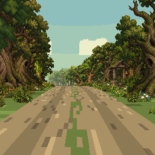

# Unity 2D Sprite World

**Механика построения 3D-мира с использованием плоских 2D-спрайтов в Unity.**

Прототип прогулки от первого лица: камера движется по настоящему трёхмерному маршруту, а деревья, трава, цветы и часть декораций представлены плоскими изображениями. Перспектива, глубина и параллакс создают ощущение объёмного мира.

Основная демосцена — просёлочная дорога с плавными поворотами, подъёмами и спусками, густой растительностью и лёгким средневековым настроением. Итоговое игровое изображение рендерится в **256 × 256 пикселей**.



## Запуск

Проект создан в **Unity 6000.2.14f1 (Unity 6.2)**, Built-in Render Pipeline.

```sh
git clone https://github.com/Tallmann999/unity-2d-sprite-world.git
```

1. В Unity Hub добавьте папку клонированного проекта через **Add project from disk**.
2. Откройте её в Unity 6000.2.14f1 и дождитесь импорта ассетов и восстановления пакетов.
3. Откройте `Assets/Scenes/CountryRoad256.unity`.
4. Нажмите **Play**, затем щёлкните по окну **Game**, чтобы оно получало нажатия клавиш.

Для первой, абстрактной демосцены откройте `Assets/Scenes/FlatDungeon.unity`.

В Windows также доступны `Открыть просёлочную дорогу.cmd` и `Открыть сцену.cmd`. Они используют Unity CLI, если команда `unity` доступна в PATH. При её отсутствии откройте проект через Unity Hub. MCP и инструменты генерации изображений для запуска сцен не нужны.

## Управление

| Клавиша | Действие |
| --- | --- |
| W / ↑ | Идти вперёд |
| Пробел | Включить или остановить автопрогулку |
| R | Вернуться в начало |

Камера сама следует направлению дороги; ручного вращения мышью нет. В конце маршрута движение останавливается. Враги и боевая система отсутствуют.

## Как 2D-спрайты образуют 3D-мир

1. **Настоящее 3D-пространство.** Декорации стоят на разных координатах X, Y и Z. Перспективная камера уменьшает удалённые объекты; при движении ближние растения смещаются быстрее дальних — появляется параллакс.
2. **Плоские декорации.** `SpriteRenderer` показывает PNG с прозрачностью. Изображение дерева остаётся плоскостью, но занимает своё место в объёмной сцене.
3. **Поворот к камере.** `UprightBillboard` выравнивает спрайты по повороту камеры вокруг вертикальной оси. Деревья остаются вертикальными и видимыми на изгибах дороги. Этот приём рассчитан на ограниченный обзор вдоль маршрута.
4. **Геометрия под ногами.** Рельеф, дорога, простой забор и каменные столбы используют 3D-геометрию. Её сочетание со спрайтами создаёт основу уровня.
5. **Глубина и прозрачность.** Шейдер `FlatDepth/Card` отсекает прозрачные пиксели, записывает глубину и поддерживает туман. Непрозрачные части декораций перекрывают более далёкие объекты.
6. **Движение по пути.** `CountryPath` задаёт форму и высоту дороги, а `CountryWalker` перемещает камеру над ней и направляет вдоль маршрута. Это движение по заданному пути, без свободного исследования рельефа и физического контроллера персонажа.
7. **Пиксельное изображение.** `PixelViewport` выводит сцену через RenderTexture 256 × 256 с Point-фильтрацией, без MSAA и HDR. На экранах от 256 пикселей изображение увеличивается целым множителем, сохраняя квадратную форму и поля. Исходные атласы имеют большее разрешение: 256 × 256 относится к итоговому кадру.

## Демосцены

| Сцена | Содержание |
| --- | --- |
| `CountryRoad256` | Маршрут около 140 м с перепадом высот около 3,6 м; 2704 спрайта, включая 301 дерево пяти видов, семь вариантов низкой растительности и три придорожных навеса; вывод 256 × 256 |
| `FlatDungeon` | Прямой коридор длиной 48 м: девять секций, 119 квадратных спрайтов и три цветовые палитры; обычное разрешение вывода |

## Структура проекта

```text
Assets/
  Scenes/          Сохранённые демосцены
  Scripts/         Движение, маршрут, billboard и пиксельный вывод
  Shaders/         Спрайты, земля и небо
  Editor/          Генераторы сцен и проверки
  Countryside/     Атласы, спрайты, материалы и меши дороги
  FlatDungeon/     Декорации и заготовка секции коридора
  Screenshots/     Кадры из демосцен
Packages/          Манифест и зафиксированные версии зависимостей
ProjectSettings/  Настройки Unity
```

## Создание новых уровней

- Скопируйте демосцену под новым именем и редактируйте позиции, масштабы и цвета декораций в иерархии. Для дороги растения находятся в группе `FLAT SPRITES`.
- Для собственных растений импортируйте PNG как **Sprite (2D and UI)**, выберите **Point** для фильтрации и поставьте pivot у основания. Назначьте спрайт `SpriteRenderer`, материал `Plants` из `Assets/Countryside/Materials` и компонент `UprightBillboard`.
- Меняйте форму маршрута в `CountryPath.cs`, а скорость и поведение камеры — в `CountryWalker.cs`. После изменения формы пути пересоздайте геометрию и расположение декораций генератором.
- Плотность, подбор декораций и их процедурное размещение задаются в `BuildCountryRoad.cs`. Генерация использует фиксированное начальное значение случайных чисел для повторяемого результата.
- Для коридоров используйте `Assets/FlatDungeon/Prefabs/EditableSection.prefab` как заготовку секции.

Меню **Flat Depth → Build countryside 256 scene** и **Flat Depth → Rebuild demo scene** заново создают соответствующие демосцены и генерируемые ассеты. Они перезаписывают ручные изменения в этих демосценах; сохраняйте собственные уровни отдельно, а изменённые генерируемые ассеты дублируйте.

На этой основе можно строить игру из последовательных участков пути, добавляя события, предметы, переходы, звук, интерфейс и сохранение прогресса. В текущем репозитории реализован прототип визуальной системы и движения; перечисленные игровые системы ещё не реализованы.

## Unity и Git

`.gitignore` основан на [шаблоне Unity из github/gitignore](https://github.com/github/gitignore/blob/main/Unity.gitignore) и дополнен исключениями для локальных настроек и секретов.

**В репозитории должны храниться:**

- `Assets/` вместе со всеми `.meta`-файлами;
- `Packages/manifest.json` и `Packages/packages-lock.json`;
- `ProjectSettings/`;
- документация, `.gitignore` и `.gitattributes`.

**Не должны храниться:** `Library/`, `Temp/`, `Obj/`, `Logs/`, `UserSettings/`, сборки, автоматически созданные решения IDE, локальные настройки инструментов, файлы `.env` и ключи подписи. Unity восстановит кэш после клонирования.

В настройках проекта уже включены **Asset Serialization → Force Text** и **Version Control → Visible Meta Files**. `.meta` содержат GUID ассетов: их нужно коммитить и перемещать вместе с соответствующими файлами, иначе ссылки в сценах и материалах могут потеряться.

`.gitattributes` задаёт обработку текстовых и бинарных файлов и окончания строк. Текущие ассеты помещаются в обычный Git. Если проект вырастет и появятся большие бинарные исходники, настройте Git LFS до их первого коммита.

## Автоматизация и проверка

В проект включён пакет `com.unity.pipeline` версии `0.7.0-exp.1` для автоматизации через Unity MCP. Персональные настройки MCP-клиента в репозиторий не входят.

Генераторы `BuildFlatDungeon` и `BuildCountryRoad` содержат методы проверки `Validate`. Демосцены проверялись в Unity Editor: загрузка изображений и материалов, движение камеры, остановка в конце пути, возврат в начало и вывод дороги в 256 × 256. Автоматический CI в этом репозитории пока не настроен.

## Графические исходники

Атласы `MeadowAtlas.png` и `MedievalAtlas.png` созданы с помощью ImageGen. Исходные изображения и промпты сохранены в `Assets/Countryside/Art/`. Спрайты растений используют выбранные области атласов. Квадратные декорации первой сцены созданы процедурно.

Дополнительные сведения о дороге: [COUNTRYSIDE.md](COUNTRYSIDE.md).
